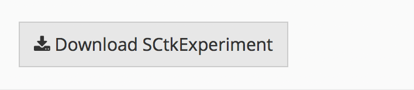

# Introduction

The quality control (QC) and filtering tab provides several summary statistics 
and ways to filter your data. The summary statistics and filtering are performed 
on the selected assay, which can be changed using the "Select Assay" drop-down.

# Data summary table


The summary table provides several summary statistics about your data including:

* The number of cells
* The number of genes
* The average number of reads per cell
* The average number of genes per cell
* Cells with fewer than the selected cutoff expressed genes
* Genes with no expression across all cells

# Filtering

Several filtering options are available

## Delete outlier genes and cells 


Data can be filtered by user selected cutoff values including:

* Remove genes with no expression across all cells. These genes are uninformative
* Minimum detected genes per cell. Cells with few expressed genes could indicate an empty well.
* Percent low gene expression. This filter will remove the genes with the least expression in the dataset
* If there are specific cells that should be excluded from the dataset

When you have set the cutoff filters to the desired level, you can filter data
with the "Filter Data" button.

## Reset to orginal data

The SCTK saves a copy of the originally uploaded data, which can be restored by
clicking the "Reset All" button in the "Delete Outliers" section.

## Filter cells by annotation


Data stored in the annotation data frame can be used for sample filtering.
Choose a column from the annotation data frame, the values from this column to
keep, and click "Filter."

## Filter genes by feature annotation


Similarly, gene annotations can be used to filter genes. Select a column from
the row data frame and the values to keep and click "Filter."

## Convert gene annotations


The SCTK can use annotation data from Bioconductor annotation packages such as 
[org.Hs.eg.db](https://www.bioconductor.org/packages/release/data/annotation/html/org.Hs.eg.db.html) to convert gene annotations between standard annotation types such as Entrez
gene ids, Ensembl gene ids, or gene symbols. By default, these packages are not
installed, so you will need to manually install the package for your appropriate
organism. Instructions for installation can be found on the
[Bioconductor website](https://www.bioconductor.org/install/#install-bioconductor-packages)

## Delete an annotation column


You can remove an unnecessary or unwanted annotation column by selecting it and
clicking the "Delete Column" button.

## Randomly Subset


If you are working with a large dataset, you may want to randomly subset the
data for exploratory analysis. Specify the number of cells that you wish to
keep in the subset data frame and click the "Subset Data" button.

## Download SCExperiment



To export the SCExperiment object from the SCTK, you can download the object
in RDS format by clicking the "Download SCExperiment" button. This file can
be loaded into the R console for downstream analysis or for later upload and 
use in the SCTK.

# Assay Normalization

The assay normalization tab allows the user to conduct simple and complex 
normalization procedures on the assays in the SCTK experiment object. These 
include log and counts-per-million transforms, as well as library size normalization
by scater and scran. It also lists the assays (raw and normalized) that are 
available in the object. 

## Available assays and basic normalization 


The assays listed on this tab are stored in the
underlying SCTK experiment object and are available on the tabs in the app.
Users can add a log(counts), CPM (counts per million), and log(CPM) matrix 
directly through the app. 

## Library size normalization 


Users can also conduct
library size normalization using the scater and scran appraoches.

# Annotation Data

The annotation tab displays the annotation matrix.


## Replace Annotation Data

To modify the annotation data frame, download the annotation data using the
"Download Annotation Data" button, modify the data using a text editor or Excel,
save the data as a .csv file, and re-upload the data in the "Upload and replace
the annotation data" field.

## Batch Correction

Note that Batch correction has its own vignette and link: [Batch Correction Tab](https://compbiomed.github.io/sctk_docs/articles/v06-tab04_Batch-Correction.html)

# Session info {.unnumbered}

```{r sessionInfo, echo=FALSE}
sessionInfo()
```
