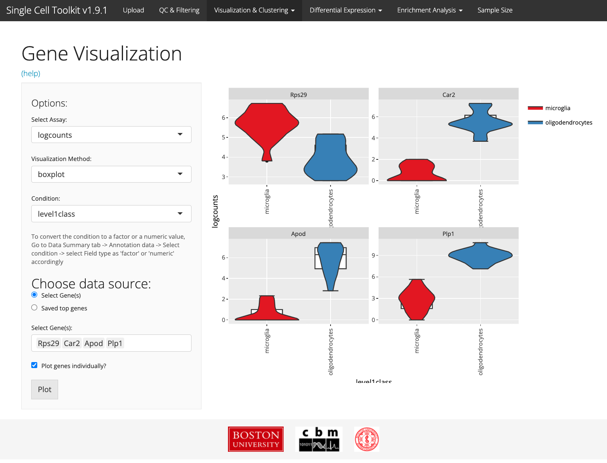
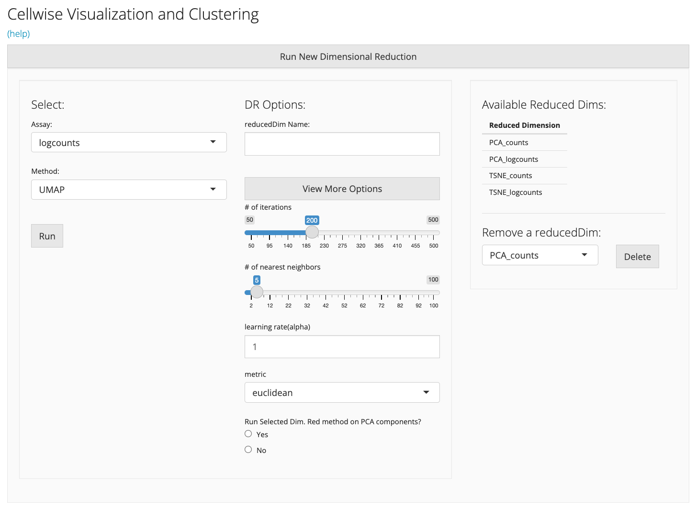
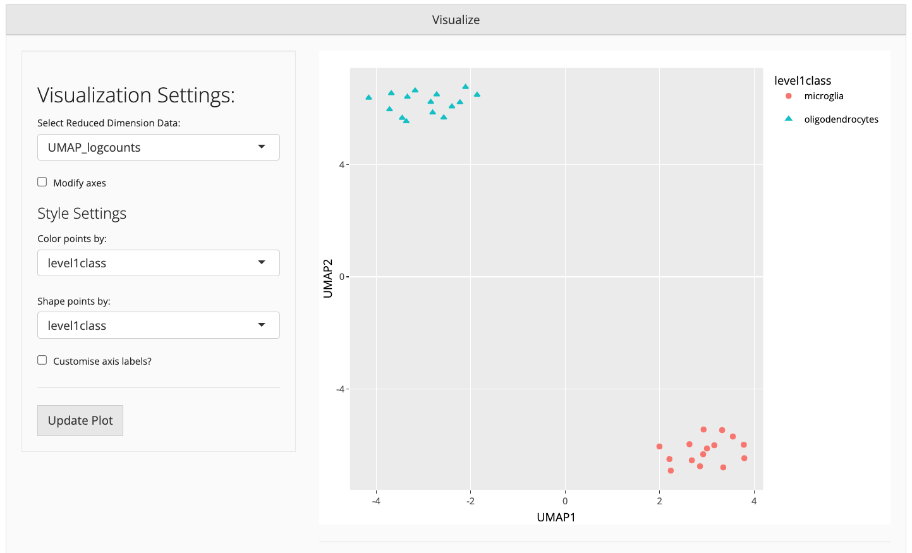
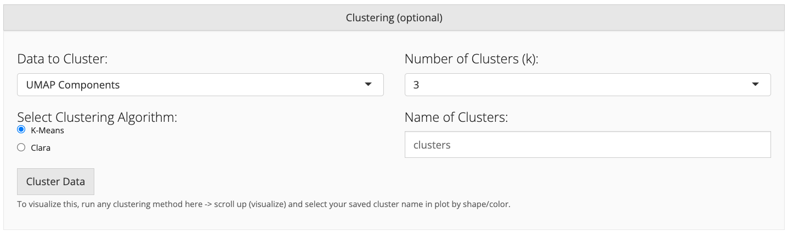

# Introduction

Visualization of scRNA-Seq data is crucial for identifying cell identifies as 
well as learning functional subclusters of cells present in the data. The 
visualization and clustering tab can be used to visualize scRNA-Seq data at the 
gene and sample level, and to reduce dimensions and cluster data for downstream analysis. The tab has 3 subtabs, Gene visualization, cell-wise visualization and clustering, and Celda. In some cases the values for
these tabs can be precomputed, and the results will be stored inside the object. 
For this tab, especially for the cell-wise visualization, analysis results can be 
stored in the reducedDim slot of the SingleCellExperiment object. For example large
datasets, PCA and t-SNE can take a long time, so pre-computing this data is
recommended. If you wish to re-run PCA or t-SNE, you can click the "Re-run"
button and the data will be replaced.

# Gene Visualization
The Gene-wise Visualization subtab helps users to visualize gene expression 
data versus annotation data for one or multiple genes of interest using either 
a boxplot, scatterplot, barplot, or heatmap. The types of plots available 
depends on the nature of the annotation variable of interest (e.g. factor data, 
numeric values, etc.). This can be helpful for visualizing individual genes of 
interest, including cell-identifying marker genes, or for displaying 
housekeeping genes for sample quality control or for quantifying housekeeping 
genes or artificial spike-in controls for sequencing quality control.



# Cellwise Visualization and Clustering

The Cellwise Visualization and Clustering subtab includes dimensionality 
reduction and clustering techniques to allow users to visualize their scRNA-Seq 
in lower dimensional space. For example, the SCTK uses principal component 
analysis (PCA) to transform the expression matrix into orthogonal, linear 
dimensions that increasing describe the variation observed in the data. Furthermore,
the SCTK can use popular non-linear dimension reduction methods such t-SNE and UMAP. 
We note that by default, the t-SNE and UMAP functions operate on a subset of the
PCA-reduced data but can be applied on the raw data if desired.

## Dimension reduction
The Cell-wise Visualization and Clustering subtab in the SCTK provides a list 
of available (pre-computed) reduced dimension datasets available in the 
SingleCellExperiment object (if any are available). The user can select an assay 
matrix (e.g. counts, log-counts, counts per million, etc), and interactively 
apply one of the dimension reduction algorithms on the dataset (e.g. PCA, t-SNE, 
UMAP). For smaller datasets, users can perform PCA, t-SNE, and UMAP directly 
through the SCTK Shiny app. The resulting reduced data matrices will be stored 
in the underlying object for future use and downstream visualization, and will 
be available when the data object is downloaded (or re-uploaded). Because some 
of these algorithms can take a long time to compute on large datasets (e.g. 
t-SNE on >5,000 cells), users can precompute these reduced dimension data from 
the console, on the cluster, or in a preprocessing workflow, and store the 
reduced dimension results in the SingleCellExperiment object before uploading 
the object into the SCTK user interface. 



## Visualization
The resulting reduced dimension data can be efficiently displayed in the 
visualization box. Annotation information can be added to the plot by selecting 
annotations with which to color or shape the points in the scatterplot. 



## Clustering
After visualization of the data, users may want to stratify the scRNA-Seq data 
into clusters that appear during dimensionality reduction. Users can choose to 
cluster their data using k-means clustering, hierarchical clustering, or CLARA 
(Clustering for Large Applications). After the clustering algorithm is complete, 
the visualization plot can be updated to to display the resulting clusters. 
The cluster results, the cluster assignments are stored in the annotation data 
frame (colData) of the SingleCellExperiment object. The clusters can then be 
used to filter the data for downstream visualization (e.g. differential 
expression within one or more clusters/cell types).




# Session info {.unnumbered}

```{r sessionInfo, echo=FALSE}
sessionInfo()
```
