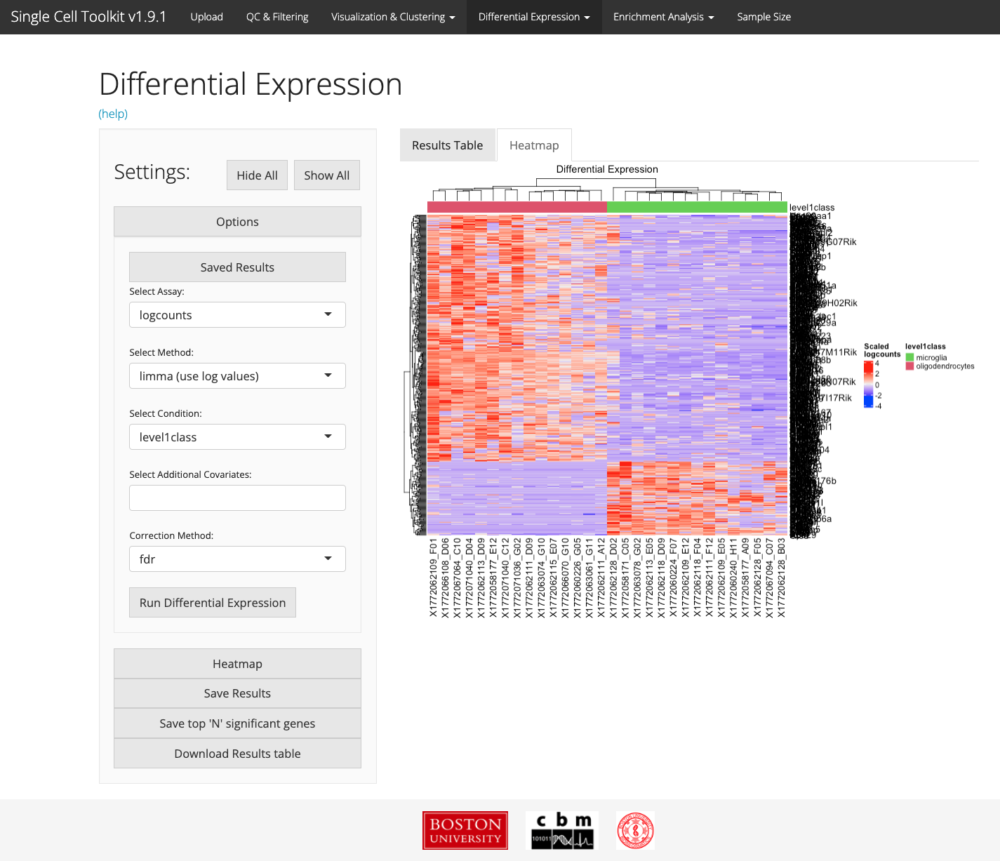
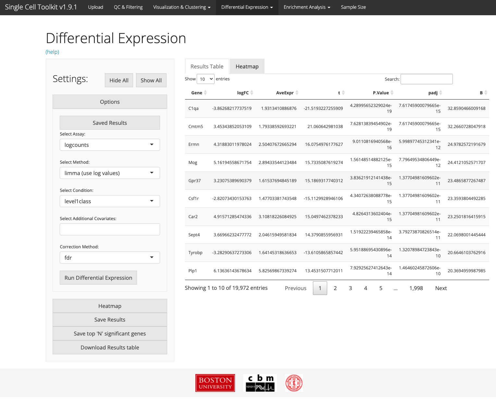
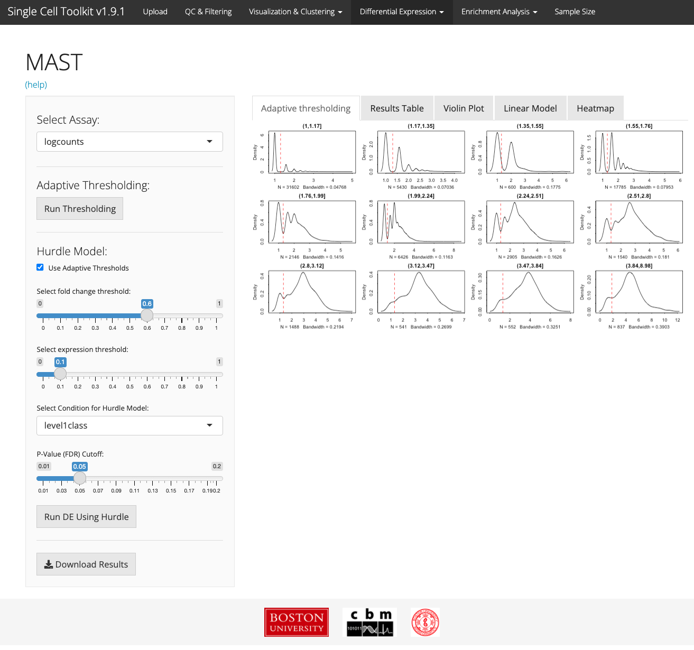
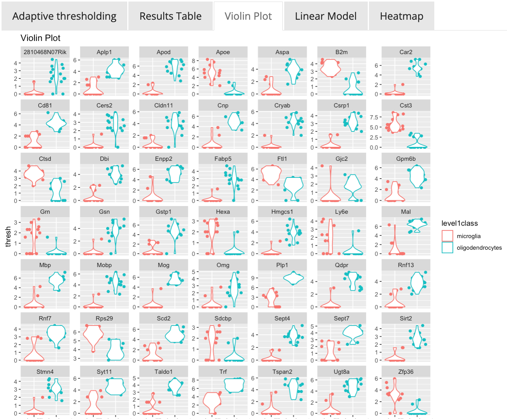
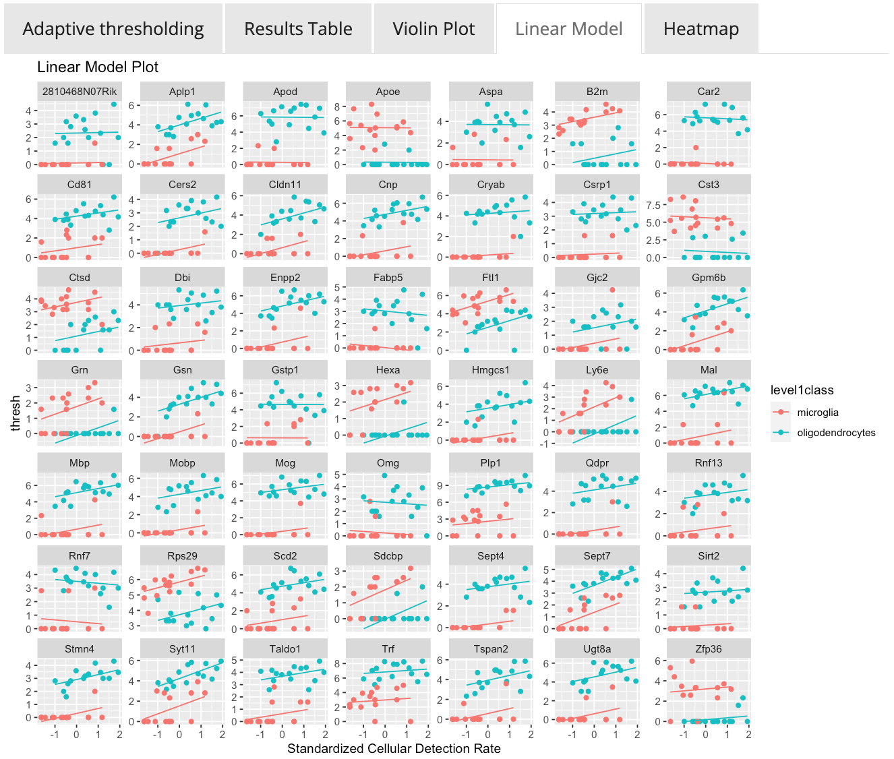
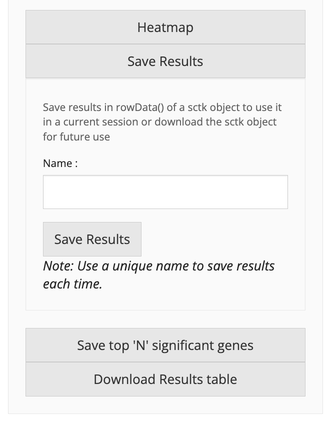
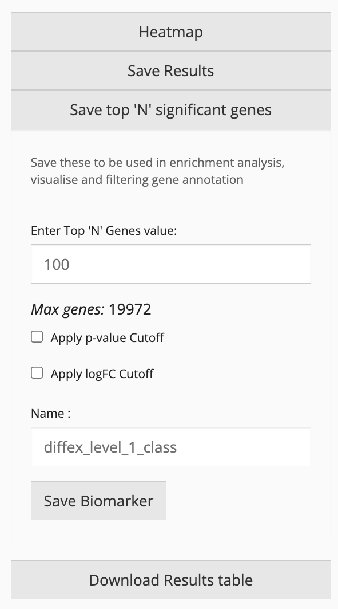
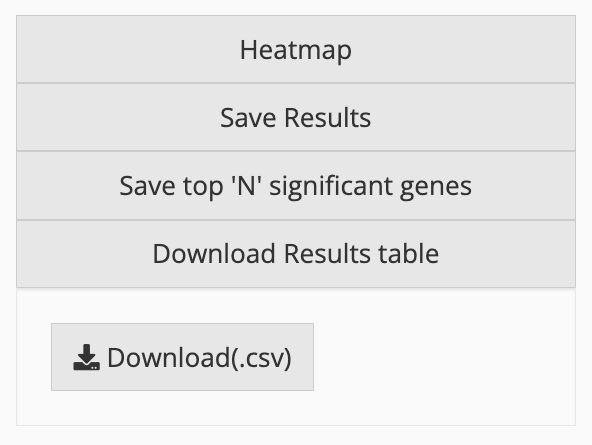

# Introduction

Differential expression analysis can identify genes that are significantly up or
down regulated between conditions. While many differential expression algorithms
exist, their performance may vary on scRNA-Seq datasets.

# limma, DESeq2, and ANOVA

Users can apply common differential expression algorithms
[limma](https://bioconductor.org/packages/release/bioc/html/limma.html),
[DESeq2](https://bioconductor.org/packages/release/bioc/html/DESeq2.html), or
perform an ANOVA to identify differentially expressed genes by selecting one or
multiple condition variables present in the annotation information. After
choosing the assay of interest using the "Select Assay" field and the algorithm
in the "Select Method" field, choose the experimental condition and any
additional covariates to use in the differential expression model. The
resulting genes will be differentially expressed between the factor of interest
and all other cells. Users can also add addition covariates to control for in the model and
customize the differential expression results by changing p-value correction method
applied to the results. 

## Visualization



The resulting gene list is displayed as a table in the "Results Table" tab and
also in a heatmap in the "Heatmap" tab, which can also be customized using the
options available in the "Options" tab. Users can download the gene list
directly or create a biomarker list for a specific cell type or cell cluster,
which can be stored in the gene annotation information in the SCExperiment
object.


# MAST



[MAST](https://www.bioconductor.org/packages/release/bioc/html/MAST.html),
Model-based Analysis of Single-cell Transcriptomics, is a differential
expression analysis tool specifically designed for single cell RNA-Seq data,
which uses a hurdle model to account for the missingness in scRNA-Seq data.
MAST has been implemented within the SCTK. Users can choose whether to use
MAST’s adaptive thresholding model, choose fold change and expression
thresholds, and identify significant genes based on conditions present in the
annotation information provided. The results are presented in a table, violin
plots, or visualized in a heatmap. For detailed information about MAST analysis,
see the [MAST documentation](https://www.bioconductor.org/packages/release/bioc/html/MAST.html).





# Saving and Downloading Results 
After differential expression analysis has been performed, there are several 
convenient options for downstream usage of the results. If desired, the entire
resulting analysis can be stored in the SCExperiment object for future use. The 
user can access these results in the "Saved Results" button at the top of the 
"Options" panel.

{width="50%"}

The user can also store the differential gene list, "Save to 'N' Signficant genes" 
for additional analysis or pathway enrichment analysis in other parts of the SCTK. 

{width="50%"}

Finally, the results can be downloaded in .csv form for viewing and use outside the SCTK and outside of R.  
{width="50%"}


# Session info {.unnumbered}

```{r sessionInfo, echo=FALSE}
sessionInfo()
```
